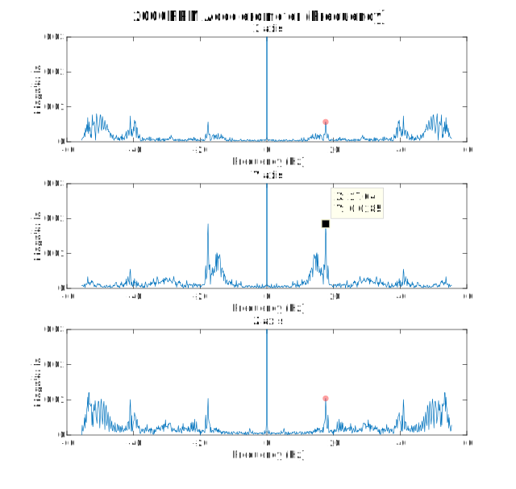
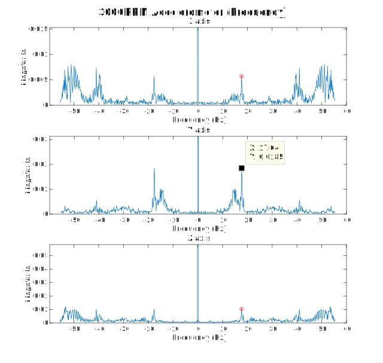

# Automobile Analytics
_data-driven driving_

## Background
Improving driving skills can be a stressful and confusing endeavor. A skilled
driver can improve the experience of passengers and create a safer environment
for other vehicles on the road. New drivers often don't know what a smooth shift
(or a smooth turn) feels like. 

### Purpose
Automobile Analytics intends to make it easier for new/inexperienced and rideshare drivers to improve their driving ability through real time analysis and feedback via a downloadable app.

## How it works
By utilyzing the accelerometer and gyroscope found in smaratphones, we can identify different driving maneuvers such as turning, braking, starting, and shifting (for manual cars). After identifying maneuvers,
the forces can be quantified and compared against recommended values.

_After mounting a smartphone on the dashboard of a car, we can estimate the acceleration and orientation of the vehicle by applying a change of basis to the approximate center of mass of the car._

### Recognizing movements
Automobile Analytics focused on a few basic driving behaviors such as, turning, braking, starting and stopping. Using a dashboard mounted phone, we can utilize accelerometer data to identify if the vehicle is turning too sharply, stopping too hard,  starting in a not smooth manner, or shifting in an unsettling way.

### Detecting Engine RPM
In order to analyze shifting data for manual transmission drivers, our app can determine engine RPM based on engine vibration, felt through the dashboard of the vehicle. A quick momentary drop in engine rpms is an easy way to identify an upshift while rapid changes in accelerometer data indicates rough shifts.

_In most four-stroke engines, there are two combustions per revolution of the crankshaft ([image source](https://xorl.wordpress.com/2011/03/05/the-basics-of-4-stroke-internal-combustion-engines/))._

For the car tested, we identified that there should be two combustions per rotation of the crankshaft. This was important for us because we attributed each pulse of engine vibration to an individual combustion.

Using this equation we were able to estimate what frequency engine RPM would appear as and then analyze the accelerometer data recorded by the phone at different engine RPMs to see if the frequency showed up in our collected data.

While idling at about 750RPM, we found significant peaks in all three axes at a frequency of 27Hz, which converts to approximately 810 RPM.
While smaller peaks are evident at roughly 13.5Hz (the engine RPM without a factor of 2), we found that frequency present in our measurements regardless of the engine RPM, indicating that it may relate to the frequency response of the dashboard/car than the engine's vibrations.

_Note the presence of the 17.5Hz frequency regardless of engine RPM._

The sensors we used for the prototype were limited to a sampling rate of 100Hz, which allowed us to measure engine RPMs as high as 1500 before reaching the Nyquist frequency. We also tried to measure the engine RPM using a microphone (with sampling rates as high as 8000Hz), but picked up exhaust noise more than anything else and were unable to correlate it with the engine frequency.

## Future Steps

There are several possible steps forward. In order to better determine engine RPM, most modern phones support at least sampling rates of at least 200Hz, which would double our measurable range.

Reading engine RPM data from the OBDII port (a diagnostics port found in most modern cars) instead of accelerometer data would give the direct engine RPM instead of an approximation. For our proof of concept we did not use OBDII data because it requires a difficult to find hardware adapter to read data directly from the port, and adds additional setup/cost to the system.

Another step would be to include a source of vocal feedback, ideally the phone would speak to the driver to notify them of their poor driving.

A final step would be to create an actual app that could be downloaded onto a phone, with some sort of a user interface so the user could interact with the app.
