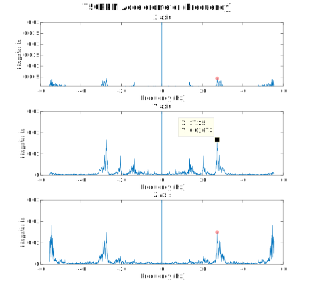
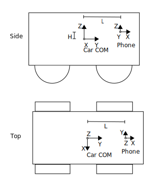

## Automobile Analytics
_Data-driven driving._

You can use the [editor on GitHub](https://github.com/newsch/automobileanalytics/edit/master/index.md) to maintain and preview the content for your website in Markdown files.

### Background
Improving driving skills can be a stressful and confusing endeavor. A skilled driver can improve the experience of passengers and create a safer environment for other vehicles on the road.

### Purpose
Automobile Analytics intends to make it easier for new/inexperienced and rideshare drivers to improve their driving ability through real time analysis and feedback via a downloadable app.

### How it works
Our app detects utilizes the accelerometer found in cell phones to identify different driving maneuvers such as turning, braking, starting, and shifting(manual). After identifying maneuvers, it then uses our custom algorithm to decide if the maneuver was more aggressive than our baseline maneuvers.

### Recognizing movements
Automobile Analytics focused on a few basic driving behaviors such as, turning, braking, starting and stopping. Using a dashboard mounted phone, we can utilize accelerometer data to identify if the vehicle is turning too sharply, stopping too hard,  starting in a not smooth manner, or shifting in an unsettling way.

### Detecting Engine RPM
In order to analyze shifting data for manual transmission drivers, our app can determine engine RPM based on engine vibration, felt through the dashboard of the vehicle. A quick momentary drop in engine rpms is an easy way to identify an upshift while rapid changes in accelerometer data indicates rough shifts. For the car tested, we identified that there should be two combustions per rotation of the crankshaft. This was important for us because we attributed each pulse of engine vibration to an individual combustion. Using this knowledge we came up with the equation, ‘Detected frequency = engine RPM * 2(combustions per rotation) * 1min/60sec’. Using this equation we were able to estimate what frequency engine RPM would appear as and then analyze the accelerometer data recorded by the phone at different engine RPMs to see if the frequency showed up in our collected data.

### Future Steps
Reading engine RPM data from the OBDII port (a diagnostics port found in most modern cars) instead of accelerometer data would give the direct engine RPM instead of an approximation. For our proof of concept we did not use OBDII data because it required a difficult to find hardware adapter to read data directly from the port, and adds additional setup/cost to the system. 
Another step would be to include a source of vocal feedback, ideally the phone would speak to the driver to notify them of their poor driving.
A final step would be to create an actual app that could be downloaded onto a phone, with some sort of a user interface so the user could interact with the app.

